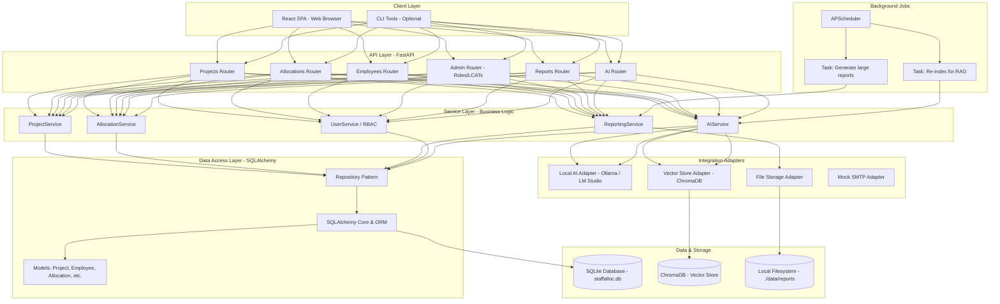

# StaffAlloc Local-First Prototype: Architecture Document

**Author:** Senior Solutions Architect
**Version:** 1.0
**Date:** Current Date

## 1. Executive Summary

This document outlines the technical architecture for a local-first prototype of the StaffAlloc platform. The primary objective of this prototype is to validate the core user experience and AI-driven features on a single developer laptop, eliminating the need for paid cloud dependencies and enabling rapid, cost-effective iteration. By building a fully functional, self-contained application, we can test the most critical user stories—from the interactive allocation grid to the AI-powered RAG chat—and gather essential feedback before committing to a scalable cloud infrastructure.

Our technology stack is aligned with modern, efficient development practices, centered around a Python backend. We will use **FastAPI** for its high performance and automatic documentation, **Pydantic** for robust data validation, and **SQLAlchemy** for a powerful and flexible Object-Relational Mapping (ORM). The database will be a single **SQLite** file, configured for optimal local performance. For the AI features, we will integrate with a locally running Large Language Model (LLM) via **Ollama** and use a local vector database like **ChromaDB** to power the Retrieval-Augmented Generation (RAG) capabilities. The frontend will be a **React** Single-Page Application (SPA) to deliver the required interactive, spreadsheet-like experience.

This local-first approach deliberately constrains the system to a developer's machine, forcing us to build an efficient and portable core application. It allows us to focus entirely on implementing business logic and user-facing features, deferring the complexities of cloud deployment, scalability, and operations. The architecture is designed with a clear migration path to a production-grade cloud environment, ensuring that the work done on this prototype serves as a solid foundation for the future of StaffAlloc.

---

## 2. Logical Architecture

The StaffAlloc prototype is designed as a classic three-tier architecture with distinct layers for presentation, business logic, and data persistence. This separation of concerns ensures maintainability, testability, and a clear path for future scaling. Additional components for background processing and AI integration are included as modular adapters.



### Layer Descriptions

*   **Client Layer**: The user interface of the application.
    *   **React SPA**: A modern, component-based frontend built with React and Vite. It will manage the complex state of the allocation grid, handle user interactions, and communicate with the backend via RESTful API calls. Libraries like TanStack Table and Zustand will be used for the grid and state management, respectively.
    *   **CLI Tools (Optional)**: Python scripts using `Typer` or `Click` could be developed for administrative tasks like database seeding, user management, or running batch jobs.

*   **API Layer**: The entry point for all client requests, built with **FastAPI**.
    *   **Routers**: The API will be organized into domain-specific routers (`APIRouter`) for clarity and maintainability. Each router will handle endpoints related to a specific resource (e.g., `/api/v1/projects`, `/api/v1/ai/query`).
    *   **Dependencies**: FastAPI's dependency injection system will be used extensively to handle authentication, authorization (RBAC), and database sessions.

*   **Service Layer**: The core of the application, containing all business logic.
    *   **Orchestration**: Services orchestrate calls between the data access layer and other services to fulfill complex operations. For example, the `AllocationService` will implement the critical logic for US006, checking an employee's total FTE across all projects when a new allocation is made.
    *   **Validation**: This layer enforces business rules that go beyond simple data types, such as preventing allocations outside a project's date range or ensuring funded hours are not exceeded.

*   **Data Access Layer (DAL)**: Responsible for all interactions with the database.
    *   **SQLAlchemy**: We will use the full power of SQLAlchemy ORM to map our Pydantic models to database tables. This provides a robust, object-oriented way to interact with the data.
    *   **Repository Pattern**: We will implement repositories (e.g., `ProjectRepository`, `AllocationRepository`) to abstract the specific SQLAlchemy query logic from the service layer, making the services easier to test and the data access logic reusable.

*   **Background Jobs**: For tasks that should not block the main API event loop.
    *   **APScheduler**: A lightweight, in-process scheduler suitable for the prototype. It can be used for periodic tasks like re-indexing project and allocation data into the vector store for the RAG feature.

*   **Integration Adapters**: Interfaces to external systems (all running locally).
    *   **Local AI Adapter**: A simple client to send requests to the Ollama API (e.g., `http://localhost:11434/api/generate`).
    *   **Vector Store Adapter**: An interface for interacting with ChromaDB, handling the embedding, storage, and retrieval of documents.
    *   **File Storage Adapter**: A service for reading from and writing to the local filesystem, used for exporting reports (US016).
    *   **Mock SMTP Adapter**: For local development, a mock email service (like Python's `smtpd.DebuggingServer`) can be used to print emails to the console instead of sending them.

---

## 3. Local Deployment Architecture

This architecture is designed for simplicity and ease of use on a single developer machine. All components run as local processes without containerization.

### Process Topology & Port Assignments

A developer will run 3-4 primary processes in separate terminal windows:

| Process | Command | Port | Description |
| :--- | :--- | :--- | :--- |
| **FastAPI Backend** | `poetry run uvicorn staffalloc.main:app --reload` | `8000` | Serves the main REST API. Auto-reloads on code changes. |
| **React Frontend** | `npm run dev` (in `frontend/`) | `5173` | Runs the Vite development server with Hot Module Replacement (HMR). |
| **Background Worker** | `poetry run python -m staffalloc.worker` | `N/A` | Runs the APScheduler for background tasks. (Optional for core features). |
| **Local LLM Server** | `ollama serve` or LM Studio UI | `11434` | Provides the LLM inference API endpoint. Must be started separately. |

### Developer Workflow

1.  **Initial Setup**:
    *   `git clone <repository_url>`
    *   `cd staffalloc`
    *   `poetry install` (Installs Python dependencies)
    *   `cd frontend && npm install` (Installs Node.js dependencies)
    *   `cd ..`
    *   `cp .env.example .env` (Create and configure local environment variables)
    *   `poetry run alembic upgrade head` (Initialize and migrate the SQLite database)
    *   `poetry run python scripts/seed.py` (Populate the database with initial data)

2.  **Running the Application**:
    *   Open and run the Ollama application or `ollama serve` in a terminal.
    *   Open a terminal and run `poetry run uvicorn staffalloc.main:app --reload`.
    *   Open a second terminal and run `cd frontend && npm run dev`.
    *   Open a web browser and navigate to `http://localhost:5173`.

3.  **Running Tests**:
    *   `poetry run pytest`

### Directory Structure

The project will follow a standard structure for a modern Python backend with a separate frontend directory.

```
staffalloc/
├── .env                  # Local environment variables (untracked)
├── .env.example          # Template for .env
├── .gitignore
├── poetry.lock
├── pyproject.toml
├── README.md
├── alembic/              # Alembic migration scripts
│   ├── versions/
│   └── ...
├── alembic.ini
├── data/                 # Local data storage (untracked)
│   ├── staffalloc.db     # SQLite database file
│   ├── vector_store/     # ChromaDB vector data
│   └── reports/          # Exported Excel files
├── frontend/             # React SPA source code
│   ├── public/
│   ├── src/
│   ├── package.json
│   └── ...
├── scripts/              # Helper scripts (e.g., seed.py)
│   └── seed.py
├── staffalloc/           # Main Python application source
│   ├── __init__.py
│   ├── api/              # FastAPI routers
│   │   ├── __init__.py
│   │   ├── projects.py
│   │   └── ai.py
│   ├── core/             # Core logic and configuration
│   │   ├── __init__.py
│   │   └── config.py
│   ├── crud/             # Repository pattern implementations
│   │   ├── __init__.py
│   │   └── repository.py
│   ├── db/               # Database session management
│   │   ├── __init__.py
│   │   └── session.py
│   ├── models/           # SQLAlchemy ORM models
│   │   ├── __init__.py
│   │   └── project.py
│   ├── schemas/          # Pydantic schemas for API I/O
│   │   ├── __init__.py
│   │   └── project.py
│   ├── services/         # Business logic services
│   │   ├── __init__.py
│   │   └── allocation_service.py
│   ├── worker.py         # Background worker entrypoint
│   └── main.py           # FastAPI application entrypoint
└── tests/                # Pytest tests
    ├── __init__.py
    ├── conftest.py
    └── test_projects.py
```

---

## 4. Data & Storage Strategy

All data persistence for the prototype will leverage the local filesystem, ensuring the application is fully self-contained.

*   **Relational Database**:
    *   **Technology**: SQLite.
    *   **Configuration**: The database will be a single file located at `data/staffalloc.db`. We will enable **Write-Ahead Logging (WAL) mode** (`PRAGMA journal_mode=WAL;`) to improve concurrency and allow simultaneous reads while writes are in progress, which is crucial for the responsive UI.
    *   **Schema Management**: **Alembic** will be used to manage all database schema migrations. Every change to the SQLAlchemy models will be accompanied by a new, version-controlled migration script.

*   **Vector Storage**:
    *   **Technology**: **ChromaDB** or **LanceDB**. ChromaDB is a strong first choice due to its simplicity and maturity.
    *   **Configuration**: ChromaDB will be configured to persist its data to the local filesystem in the `data/vector_store/` directory. This ensures that embeddings do not need to be regenerated every time the application restarts.
    *   **Embedding Model**: We will use a high-performance, locally-run sentence-transformer model (e.g., `all-MiniLM-L6-v2`) via the `HuggingFaceEmbeddings` library to convert text documents into vectors.

*   **File Storage**:
    *   **Purpose**: Storing artifacts generated by the application, primarily exported Excel reports (US016).
    *   **Location**: A dedicated directory at `data/reports/` will be used. The application will write files here, and the API will provide an endpoint to download them.

*   **Configuration Management**:
    *   **Technology**: The `python-dotenv` library will be used to load environment variables from a `.env` file at application startup.
    *   **Content**: The `.env` file will contain all configuration, including the database URL (`DATABASE_URL=sqlite+aiosqlite:///./data/staffalloc.db`), local AI endpoint, secret keys, and other settings. This keeps configuration separate from code.

---

## 5. AI & Automation Features

The AI features are central to StaffAlloc's value proposition. The local-first prototype will implement these using locally-hosted models to prove functionality without incurring API costs.

### Local LLM Integration

*   **Platform**: **Ollama** will be the primary integration target. It provides a simple, consistent API for running a variety of open-source LLMs (e.g., Llama 3, Mistral, Phi-3) locally.
*   **Interaction**: The `AIService` will contain a client that makes HTTP requests to the Ollama API endpoint (`http://localhost:11434`).
*   **Model Selection**: We will start with a small, fast model (e.g., `phi3:mini`) for real-time chat and potentially use a more powerful model (e.g., `llama3:8b`) for more complex analysis or summarization tasks.

### RAG Chat Implementation (US009, US010)

The RAG pipeline enables the AI to answer questions based on the application's live data.

1.  **Data Preparation & Indexing**:
    *   A background job (or a manually triggered script) will read data from the SQLite database.
    *   It will construct plain-text "documents" for each relevant piece of information. For example:
        *   `"Employee: John Smith. Role: SW Engineer. LCAT: Level 3."`
        *   `"Project: Project Alpha. Client: ACME Corp. Start: 2025-01-01. Sprints: 18."`
        *   `"Allocation: John Smith is allocated to Project Alpha for 80 hours in September 2025, which is 50% FTE."`
    *   These documents will be converted into vector embeddings using a local sentence-transformer model.
    *   The embeddings and the original text documents will be stored in ChromaDB. This process will run periodically to keep the vector store in sync with the relational database.

2.  **Query Execution**:
    *   When a user submits a query (e.g., "Show me all Cyber Analysts with less than 50% FTE in November"), the `AIService` performs the following steps:
    *   The user's query is converted into a vector embedding using the same model.
    *   A similarity search is performed against ChromaDB to retrieve the most relevant text documents (the "context").
    *   A detailed prompt is constructed, including the original user query and the retrieved context.
    *   This combined prompt is sent to the local LLM via the Ollama API.
    *   The LLM's response is streamed back to the user through the API and displayed in the chat interface.

### AI Agent for Optimization (US013, US014)

These features go beyond simple Q&A and involve structured decision-making. The "agent" is not a single autonomous entity but rather a set of specialized functions within the `AIService`.

*   **Recommendation Engine (US013)**:
    *   This will be primarily a deterministic database query.
    *   The service will query the database for employees who match the required `Role`, are not already on the project, and have an FTE below a certain threshold during the target period.
    *   The LLM's role will be to take the structured list of candidates and generate a user-friendly, natural language summary for the UI, as described in the acceptance criteria.

*   **Conflict Resolution (US014)**:
    *   The `AllocationService` detects the over-allocation (>100% FTE).
    *   The `AIService` is then invoked. It analyzes the conflict (e.g., Sarah is over-allocated by 32 hours in May).
    *   It then runs structured queries to find potential solutions:
        1.  Can Sarah's hours be reduced on one of her projects?
        2.  Is there another employee with the same role and availability who can take on 32 hours of her work?
    *   The LLM is used to transform these structured solutions into the clear, actionable options presented to the user (e.g., "1. Reduce Sarah's hours on Project Beta by 32 hours.").

---

## 6. Security & Privacy

Even for a local prototype, establishing a solid security foundation is crucial.

*   **Authentication**:
    *   **Mechanism**: **JWT (JSON Web Tokens)**.
    *   **Flow**: The user will submit credentials to a `/api/v1/token` endpoint. Upon successful validation, the API will return a short-lived access token and a long-lived refresh token. The access token will be sent in the `Authorization` header of subsequent requests. The frontend will handle token storage and refresh logic.
    *   **Library**: `python-jose` will be used for creating and decoding JWTs.

*   **Authorization (RBAC)**:
    *   **Implementation**: Role-Based Access Control will be enforced using FastAPI's dependency injection system.
    *   **Roles**: We will define roles (e.g., `PM`, `Director`, `Admin`) in the database. A user's role will be encoded in their JWT payload.
    *   **Enforcement**: Custom dependencies will be created (e.g., `get_current_active_user`, `is_project_manager`). API endpoints will be decorated with these dependencies to ensure a user has the necessary permissions before the endpoint logic is executed. For example, a `DELETE /projects/{project_id}` endpoint would require the user to be the manager of that specific project or an admin.

*   **Secrets Management**:
    *   For the local prototype, all secrets (e.g., `JWT_SECRET_KEY`) will be stored in the `.env` file. This file is explicitly listed in `.gitignore` and will never be committed to source control.

*   **Data Privacy**:
    *   Since all data resides on the local machine, there is no risk of data exposure over the network to third parties. The prototype can be run entirely offline after initial setup.

*   **Data Encryption**:
    *   **In Transit**: Not applicable for a purely local setup. In a production deployment, TLS would be enforced at the load balancer/web server level.
    *   **At Rest**: The SQLite database file will not be encrypted by default. If required for specific compliance needs even during development, an extension like **SQLCipher** could be integrated, but this is considered out of scope for the initial prototype.

---

## 7. Testing & Quality

A robust testing strategy ensures the reliability of the application and speeds up development by catching regressions early.

*   **Unit & Integration Testing**:
    *   **Framework**: **Pytest** will be the test runner.
    *   **Database**: Tests will run against a separate, **in-memory SQLite database**. This provides complete isolation between test runs and is significantly faster than hitting a file on disk. A Pytest fixture will handle the creation and teardown of the database and tables for each test function.
    *   **API Testing**: FastAPI's `TestClient` will be used to make requests to the API endpoints directly from within the tests, allowing us to test the full request-response cycle without needing a running server.
    *   **Coverage**: We will aim for high test coverage, especially for the critical business logic in the service layer and the complex queries in the data access layer.

*   **Static Analysis & Linting**:
    *   **Linter/Formatter**: **Ruff** will be used for extremely fast code linting and auto-formatting. This ensures a consistent and clean codebase.
    *   **Type Checking**: **Mypy** will be used for static type analysis. We will leverage Python's type hints throughout the codebase to catch a wide range of potential errors before runtime.

*   **Continuous Integration (CI)**:
    *   **Platform**: A **GitHub Actions** workflow will be configured.
    *   **Workflow**: On every push and pull request to the main branches, the CI pipeline will automatically:
        1.  Install dependencies (`poetry install`).
        2.  Run the linter (`ruff check .`).
        3.  Run the type checker (`mypy .`).
        4.  Run the entire test suite (`pytest`).
    *   This ensures that no code that breaks tests or violates quality standards can be merged.

---

## 8. Observability

While extensive observability is more critical for production, establishing good practices early is beneficial.

*   **Logging**:
    *   **Library**: **Structlog** will be used for structured logging.
    *   **Configuration**: Logging will be configured to output JSON-formatted logs to the console. This makes them easy to parse and query, a practice that translates well to production log aggregation systems (like the ELK stack or Datadog).
    *   **Content**: Logs will include a timestamp, log level, message, and bound context such as user ID, request path, and other relevant details.

*   **Health Checks**:
    *   A simple, unauthenticated `/health` endpoint will be created.
    *   This endpoint will perform a basic check, such as making a simple query to the database (`SELECT 1`), to confirm that the application is running and can connect to its essential dependencies.

*   **Metrics & Tracing (Future Consideration)**:
    *   For the local prototype, detailed metrics and tracing are out of scope.
    *   However, the architecture will be designed to easily accommodate **OpenTelemetry** in the future. When moving to the cloud, we can add middleware to automatically instrument API requests, database queries, and service calls to export traces and metrics to a system like Prometheus, Jaeger, or Datadog.

---

## 9. Risks & Migration Path

This section identifies potential challenges with the local-first approach and outlines a clear, phased strategy for evolving the prototype into a production-ready cloud application.

### Risks & Mitigations

| Risk | Description | Mitigation Strategy |
| :--- | :--- | :--- |
| **SQLite Performance Limitations** | SQLite, while fast, is not designed for high-concurrency write scenarios. Complex dashboard queries across 500+ projects could become slow. | 1. Enable WAL mode for better concurrency. <br> 2. Write highly optimized SQLAlchemy queries and use database indexes. <br> 3. For the prototype, accept minor performance degradation under heavy load. <br> 4. The migration path explicitly includes moving to PostgreSQL. |
| **Local LLM Quality & Speed** | Locally-run LLMs may be slower and provide lower-quality responses than state-of-the-art cloud APIs (e.g., GPT-4, Claude 3). | 1. Set clear expectations with stakeholders that this is for functional validation. <br> 2. Use smaller, quantized models for faster inference. <br> 3. Focus on prompt engineering to get the best possible results from local models. <br> 4. Design the `AIService` adapter to be easily swappable with a client for a cloud-based LLM API. |
| **RAG Context Staleness** | The data in the vector store can become out of sync with the primary SQLite database between indexing runs. | 1. Implement a background job with APScheduler to re-index data frequently (e.g., every 5-10 minutes). <br> 2. For highly critical operations, the service can directly query the SQLite DB to supplement the RAG context. |
| **Complex Frontend State** | The interactive allocation grid is state-intensive. Managing this without a robust pattern can lead to bugs and performance issues. | 1. Select a mature state management library (e.g., Zustand or Redux Toolkit). <br> 2. Use virtualization for the grid (e.g., TanStack Virtual) to ensure performance with hundreds of rows. |
| **Developer Environment Divergence** | Inconsistent Python, Node, or OS versions across developer machines can lead to "works on my machine" issues. | 1. Pin all dependency versions using `poetry.lock` and `package-lock.json`. <br> 2. Provide clear setup instructions in the README. <br> 3. For a larger team, introduce Docker and `docker-compose.yml` for a fully consistent development environment. |

### Migration Path to Cloud Architecture

The local-first prototype is a stepping stone. The following phased approach details how to transition to a scalable, production-grade cloud architecture (e.g., on AWS).

1.  **Phase 1: Foundational Infrastructure**
    *   **Database**: Replace SQLite with a managed PostgreSQL instance (e.g., AWS RDS). Update the `DATABASE_URL` and SQLAlchemy dialect.
    *   **Containerization**: Create `Dockerfile`s for the FastAPI backend and the React frontend (using a multi-stage build with Nginx). Create a `docker-compose.yml` file for local containerized development.
    *   **Deployment**: Deploy the containers to a managed service like AWS App Runner or ECS with Fargate.

2.  **Phase 2: Scalable Storage & AI**
    *   **File Storage**: Replace local filesystem storage with an object storage service (e.g., AWS S3). Update the `FileStorageAdapter` to use the `boto3` SDK. Generate pre-signed URLs for secure downloads.
    *   **Vector Database**: Replace the local ChromaDB instance with a managed vector database (e.g., Pinecone, Weaviate) or a self-hosted instance (e.g., Qdrant on Kubernetes).
    *   **LLM Integration**: Update the `LocalAIAdapter` to an `OpenAIAdapter` or `BedrockAdapter`. Store API keys securely using a secrets management service.

3.  **Phase 3: Production Hardening**
    *   **CI/CD**: Evolve the GitHub Actions workflow to a full CI/CD pipeline that automatically builds Docker images, pushes them to a container registry (e.g., ECR), and deploys to staging and production environments.
    *   **Secrets Management**: Move all secrets from `.env` files to a dedicated service like AWS Secrets Manager or HashiCorp Vault.
    *   **Observability**: Integrate a full observability stack. Configure logging to ship to a centralized service (e.g., CloudWatch Logs). Add OpenTelemetry for distributed tracing and metrics, and visualize them with tools like Grafana, Jaeger, or Datadog.
    *   **Content Delivery**: Place a CDN (e.g., AWS CloudFront) in front of the frontend application and API for improved performance and security (WAF).